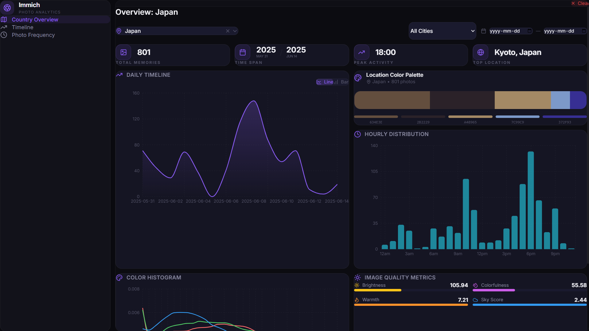
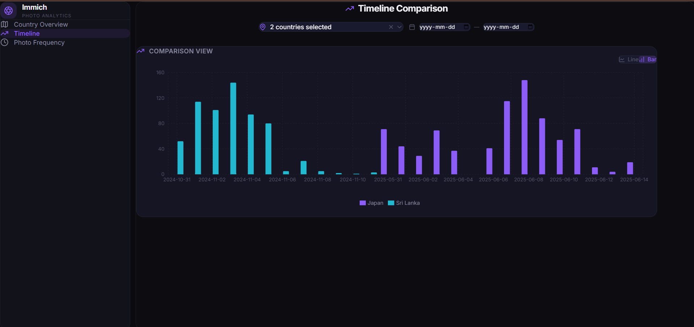

# 🖼️ Immich Gallery Analysis

⚠️⚠️⚠️⚠️Under construction, lots of changes might ocur, docker isn't ready yet (sorry haha).

A weekend project: localized visual analytics suite for your [Immich](https://immich.app/) photo library. Extract deep insights from your memories using advanced image processing and geographic metadata.

<p align="center">
  
</p>
<p align="center">
  
</p>

---

## 🚀 Quick Start

Get your dashboard up and running in two steps:
### 0. Launch The Notebooks to pre-populate the cache
```bash
cd notebooks
```
- run '00_fetch_database.ipynb' to download the metadata locally to a csv file for easy access.
- and '01_fetch_thumbnails.ipynb' to iterate over the photos and calculate histograms, dominant colors, and other features and cache them in a json file.
### 1. Launch Backend
```bash
cd backend
uv run main.py
```

### 2. Launch Frontend
```bash
cd frontend
npm run dev
```

> [!TIP]
> Once both are running, open your browser to the local development URL (usually `http://localhost:5173`) to explore your dashboard.

---

## ✨ Features

Immich Analysis is built on four core analytical pillars to help you rediscover your library:

| Pillar | Description |
| :--- | :--- |
| **📍 Location** | Geo-spatial distribution, heatmaps, and city-level drill-downs. |
| **🎨 Color** | 32-bin RGB histograms and Image Recognition Quality (IRQ) metrics like Brightness, Colorfulness, and Warmth. |
| **⏰ Moments** | Temporal analysis including Golden Hour, Night shots, and Hourly distributions. |
| **🌟 Attractions** | Identification of top photo spots and landmark clusters based on density. |

### Advanced Capabilities
- **High-Speed Processing**: Uses `NumPy` and `OpenCV` for vectorized matrix extractions from thumbnails.
- **Smart Caching**: `ThumbnailCache` ensures real-time responsiveness by storing analytical properties.
- **Dynamic Filtering**: Instantly filter your Entire library by Country, City, and Date range thanks to a `Pandas` in-memory Data Service.

---

## 🛠️ Installation & Setup

### Prerequisites
- Python 3.12+
- `uv` (Fast Python package manager)
- Node.js & npm
- Accessible Immich PostgreSQL database

### Configuration
1. **Environment Variables**:
   Copy `.env.example` to `.env` in the root directory and fill in your Immich credentials:
   ```env
   IMMICH_URL=http://your-immich-url:2283
   IMMICH_API_KEY=your_api_key
   DB_HOST=127.0.0.1
   DB_PORT=5432
   DB_NAME=immich
   DB_USER=postgres
   DB_PASSWORD=your_password
   ```

2. **Dependency Setup**:
   ```bash
   # Backend
   cd backend && uv sync
   
   # Frontend
   cd frontend && npm install
   ```

---

## 📂 Project Structure

- **`backend/`**: FastAPI service handling image processing and data serving.
  - `src/app/analysis/`: Core logic for color, location, and moments.
  - `src/db_client.py`: High-performance PostgreSQL data extraction.
- **`frontend/`**: React + Vite dashboard tailored for data visualization.
  - `src/components/charts/`: Recharts-based visual components.
- **`notebooks/`**: Legacy/research scripts for database fetching and cache population.

---

## 🤝 Contributing & Support

All suggestions are welcome! Feel free to open an issue or submit a pull request if you'd like to improve the analysis algorithms or dashboard UI.

---
*Created as a weekend project to make photo libraries more insightful.*