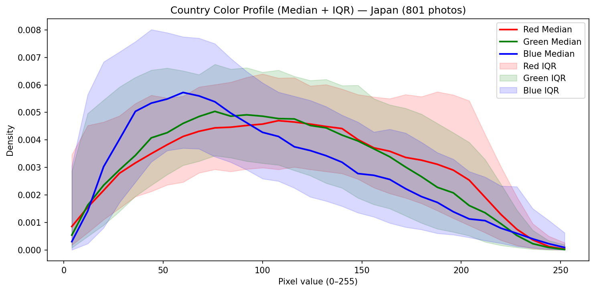

# Immich Gallery Analysis

<p align="center">
  
  
</p>

Immich Gallery Analysis is a weekend project providing a suite of tools and notebooks to analyze your data from an [Immich](https://immich.app/) instance. It fetches photo metadata and embeddings directly from your Immich database, processes location statistics, and generates comprehensive visualizations and reports of your photo library.

## Features

- **Database Extraction**: Efficiently pull image embeddings and metadata (camera, sizes, dates, etc.) directly from your Immich PostgreSQL database.
- **Location Enrichment**: Cash and enrich image metadata with location details (like country info) for geo-spatial analysis.
- **Data Visualizations**: Extensive visualizations generated in Jupyter Notebooks to explore your photography habits, timeline view of trips, and more, using tools like `plotly`, `seaborn`, and `matplotlib`.
- **Embeddings Clustering [Under development]**: Visualize relationships and clusters in your image library embeddings using UMAP.

## Project Structure

- `src/`: Core Python library modules.
  - `analyzer.py`, `clustering.py`, `data_processor.py`: Data analysis and clustering logic.
  - `db_client.py`: PostgreSQL client for fast extraction from Immich DB.
  - `immich_client.py`: HTTP API client for Immich.
  - `viz.py`: Advanced visualization functions including `TravelVisualizer`.
- `notebooks/`: The analysis pipeline, split into easy-to-run Jupyter notebooks.
  - `00_fetch_database.ipynb`: Connects to DB and downloads required extracts like embeddings and photo metadata.
  - `01_add_country_to_cache.ipynb`: Injects geographic data (countries/cities) into the local cache.
  - `02_generate_reports_from_cache.ipynb`: Generates rich statistical reports, visual charts, and timelines.

## Prerequisites

- Python 3.12+
- `uv` (recommended) or another virtual environment tool
- An accessible PostgreSQL database of your Immich instance
- Immich API key (for API tasks)

## Installation

This project manages dependencies via `pyproject.toml` and `uv` lockfile.

To install using `uv`:

```bash
# Sync dependencies and create a virtual environment
uv sync

# Alternatively, using pip:
pip install -e .
```

## Configuration

1. Copy `.env.example` to `.env`:
   ```bash
   cp .env.example .env
   ```

2. Edit `.env` with your Immich API and Database details:
   ```env
   IMMICH_URL=http://127.0.0.1:2283
   IMMICH_API_KEY=YOUR_API_KEY_HERE
   DB_HOST=127.0.0.1
   DB_PORT=5432
   DB_NAME=immich
   DB_USER=postgres
   DB_PASSWORD=YOUR_DB_PASSWORD
   ```

## Usage

Start your Jupyter environment and go through the notebooks in numerical order:
```

1. **`00_fetch_database.ipynb`**: Run this first to bootstrap your local cache from the Immich database.
2. **`01_add_country_to_cache.ipynb`**: Process location data and save to cache.
3. **`02_generate_reports_from_cache.ipynb`**: Run the visualizers and generate your insights!
```

## All suggestions are welcome :) 